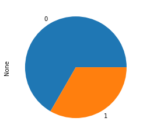
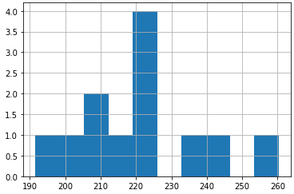

# Random Subgroups python package

## Making predictions with subgroups

**random-subgroups** is a machine learning package compatible with [scikit-learn](https://scikit-learn.org).

It uses ensembles of weak estimators, as in random forests, for classification and
regression tasks. The main difference from the random forests algorithm is that
it uses **subgroups** as estimators.

The subgroup discovery implementation of this package is made on top of the 
[pysubgroup](https://github.com/flemmerich/pysubgroup/) package. It uses many of the features 
from **pysubgroup**, but it also extends it with different quality
measures (more suitable for prediction) and different search strategies.


### Example of the classifier:
```python
from randomsubgroups import RandomSubgroupClassifier
from sklearn import datasets

data = datasets.load_breast_cancer()
y = data.target
X = data.data

sg_classifier = RandomSubgroupClassifier(n_estimators=30)

sg_classifier.fit(X, y)
```

```python
>>> sg_classifier.show_models()

Target: 0; Model: Col26>=0.27 AND Col7>=0.06
Target: 0; Model: Col3>=435.17 AND Col6>=0.11
Target: 0; Model: Col20>=18.22 AND Col3>=806.60
Target: 0; Model: Col16>=0.02 AND Col20>=15.87
Target: 0; Model: Col17>=0.01 AND Col20>=17.91
Target: 0; Model: Col20>=17.50 AND Col22>=118.60
Target: 0; Model: Col23>=1004.60 AND Col7>=0.05
Target: 0; Model: Col0>=15.33 AND Col13>=21.73
Target: 0; Model: Col22>=124.16
Target: 0; Model: Col13>=18.88 AND Col3>=716.60
Target: 0; Model: Col12>=1.39 AND Col22>=123.11
Target: 0; Model: Col23>=1030.0 AND Col6>=0.05
Target: 0; Model: Col27>=0.15 AND Col3>=358.90
Target: 0; Model: Col15>=0.01 AND Col23>=883.99
Target: 0; Model: Col0>=10.98 AND Col27>=0.16
Target: 1; Model: Col22<105.0 AND Col27<0.16
Target: 1; Model: Col20<15.53 AND Col26<0.35
Target: 1; Model: Col7<0.05
Target: 1; Model: Col13<42.86 AND Col27<0.12
Target: 1; Model: Col23<771.47 AND Col27<0.12
Target: 1; Model: Col20<17.79 AND Col25<0.20
Target: 1; Model: Col20<15.49 AND Col27<0.15
Target: 1; Model: Col13<29.40 AND Col1<19.98
Target: 1; Model: Col20<15.75 AND Col6<0.08
Target: 1; Model: Col20<15.63 AND Col27<0.20
Target: 1; Model: Col22<104.79 AND Col29<0.10
Target: 1; Model: Col20<14.69 AND Col6<0.12
Target: 1; Model: Col27<0.12 AND Col3<693.70
Target: 1; Model: Col20<16.00 AND Col6<0.09
Target: 1; Model: Col27<0.11 AND Col7<0.06
```

```python
>>> sg_classifier.show_decision(X[5])

The predicted value is: 0
From a total of 6 estimators.

The subgroups used in the prediction are:

 Predicting target 0
Col0>=10.98 AND Col27>=0.16 ---> 0
Col26>=0.27 AND Col7>=0.06 ---> 0
Col27>=0.15 AND Col3>=358.90 ---> 0
Col3>=435.17 AND Col6>=0.11 ---> 0

 Predicting target 1
Col13<29.40 AND Col1<19.98 ---> 1
Col20<15.63 AND Col27<0.20 ---> 1

The targets of the subgroups used in the prediction have the following distribution:
```



### Example of the regressor:
```python
from randomsubgroups import RandomSubgroupRegressor
from sklearn import datasets

data = datasets.load_diabetes()
y = data.target
X = data.data

sg_regressor = RandomSubgroupRegressor(n_estimators=30)

sg_regressor.fit(X, y)
```

```python
>>> sg_regressor.show_models()

Target: 98.35; Model: Col2<-0.03 AND Col5<0.05
Target: 104.24844720496894; Model: Col6>=-0.01 AND Col7<-0.00
Target: 107.71686746987952; Model: Col6>=-0.02 AND Col7<-0.00
Target: 109.73033707865169; Model: Col3<0.06 AND Col8<-0.01
Target: 191.60625; Model: Col2>=0.00 AND Col3>=-0.03
Target: 192.41304347826087; Model: Col3>=-0.02 AND Col7>=0.03
Target: 199.28795811518324; Model: Col8>=0.01
Target: 202.17094017094018; Model: Col3>=0.04 AND Col4>=-0.05
Target: 206.8709677419355; Model: Col2>=0.02 AND Col7>=-0.04
Target: 211.1290322580645; Model: Col2>=-0.02 AND Col8>=0.01
Target: 212.44036697247705; Model: Col4>=-0.01 AND Col8>=0.03
Target: 212.8655462184874; Model: Col7>=-0.00 AND Col8>=0.02
Target: 213.66935483870967; Model: Col7>=-0.01 AND Col8>=0.03
Target: 216.0079365079365; Model: Col3>=-0.02 AND Col6<-0.01
Target: 218.92233009708738; Model: Col0>=-0.03 AND Col8>=0.03
Target: 219.56435643564356; Model: Col2>=0.02 AND Col7>=-0.00
Target: 220.40740740740742; Model: Col2>=0.02 AND Col6<-0.02
Target: 220.46153846153845; Model: Col3>=-0.04 AND Col8>=0.03
Target: 222.0222222222222; Model: Col8>=0.02 AND Col9>=0.01
Target: 222.92592592592592; Model: Col2>=0.00 AND Col3>=0.03
Target: 224.375; Model: Col6<0.00 AND Col9>=0.02
Target: 224.3939393939394; Model: Col2>=0.02 AND Col7>=-0.00
Target: 224.70833333333334; Model: Col3>=0.02 AND Col8>=0.01
Target: 226.5257731958763; Model: Col2>=-0.00 AND Col8>=0.02
Target: 233.0185185185185; Model: Col2>=0.02 AND Col7>=-0.00
Target: 239.25882352941176; Model: Col2>=0.00 AND Col9>=0.02
Target: 243.9375; Model: Col2>=0.03 AND Col3>=0.01
Target: 247.63492063492063; Model: Col2>=-0.01 AND Col9>=0.05
Target: 248.56756756756758; Model: Col2>=0.03 AND Col9>=0.02
Target: 260.29411764705884; Model: Col2>=0.06 AND Col8>=-0.01
```

```python
>>> sg_regressor.show_decision(X[0])

The predicted value is: 220.93552644658507
From a total of 12 estimators.

The subgroups used in the prediction are:
Col2>=0.00 AND Col3>=-0.03 ---> 191.60625
Col8>=0.01 ---> 199.28795811518324
Col2>=0.02 AND Col7>=-0.04 ---> 206.8709677419355
Col2>=-0.02 AND Col8>=0.01 ---> 211.1290322580645
Col3>=-0.02 AND Col6<-0.01 ---> 216.0079365079365
Col2>=0.02 AND Col7>=-0.00 ---> 219.56435643564356
Col2>=0.02 AND Col6<-0.02 ---> 220.40740740740742
Col2>=0.02 AND Col7>=-0.00 ---> 224.3939393939394
Col3>=0.02 AND Col8>=0.01 ---> 224.70833333333334
Col2>=0.02 AND Col7>=-0.00 ---> 233.0185185185185
Col2>=0.03 AND Col3>=0.01 ---> 243.9375
Col2>=0.06 AND Col8>=-0.01 ---> 260.29411764705884

The targets of the subgroups used in the prediction have the following distribution:
```
