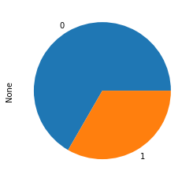

# Random Subgroups python package

## Making predictions with subgroups

**random-subgroups** is a machine learning package compatible with [scikit-learn](https://scikit-learn.org).

It uses ensembles of weak estimators, as in random forests, for classification and
regression tasks. The main difference from the random forests algorithm is that
it uses **subgroups** as estimators.

The subgroup discovery implementation of this package is made on top of the 
[pysubgroup](https://github.com/flemmerich/pysubgroup/) package. It uses many of the features 
from **pysubgroup**, but it also extends it with different quality
measures (more suitable for prediction) and different search strategies.


### Example of usage:
```python
from randomsubgroups import RandomSubgroupClassifier
from sklearn import datasets

data = datasets.load_breast_cancer()
y = data.target
X = data.data

sg_classifier = RandomSubgroupClassifier(n_estimators=30)

sg_classifier.fit(X, y)
```

```python
>>> sg_classifier.show_models()

Target: 0; Model: Col26>=0.27 AND Col7>=0.06
Target: 0; Model: Col3>=435.17 AND Col6>=0.11
Target: 0; Model: Col20>=18.22 AND Col3>=806.60
Target: 0; Model: Col16>=0.02 AND Col20>=15.87
Target: 0; Model: Col17>=0.01 AND Col20>=17.91
Target: 0; Model: Col20>=17.50 AND Col22>=118.60
Target: 0; Model: Col23>=1004.60 AND Col7>=0.05
Target: 0; Model: Col0>=15.33 AND Col13>=21.73
Target: 0; Model: Col22>=124.16
Target: 0; Model: Col13>=18.88 AND Col3>=716.60
Target: 0; Model: Col12>=1.39 AND Col22>=123.11
Target: 0; Model: Col23>=1030.0 AND Col6>=0.05
Target: 0; Model: Col27>=0.15 AND Col3>=358.90
Target: 0; Model: Col15>=0.01 AND Col23>=883.99
Target: 0; Model: Col0>=10.98 AND Col27>=0.16
Target: 1; Model: Col22<105.0 AND Col27<0.16
Target: 1; Model: Col20<15.53 AND Col26<0.35
Target: 1; Model: Col7<0.05
Target: 1; Model: Col13<42.86 AND Col27<0.12
Target: 1; Model: Col23<771.47 AND Col27<0.12
Target: 1; Model: Col20<17.79 AND Col25<0.20
Target: 1; Model: Col20<15.49 AND Col27<0.15
Target: 1; Model: Col13<29.40 AND Col1<19.98
Target: 1; Model: Col20<15.75 AND Col6<0.08
Target: 1; Model: Col20<15.63 AND Col27<0.20
Target: 1; Model: Col22<104.79 AND Col29<0.10
Target: 1; Model: Col20<14.69 AND Col6<0.12
Target: 1; Model: Col27<0.12 AND Col3<693.70
Target: 1; Model: Col20<16.00 AND Col6<0.09
Target: 1; Model: Col27<0.11 AND Col7<0.06
```

```python
>>> sg_classifier.show_decision(X[5])

The predicted value is: 0
From a total of 6 estimators.

The subgroups used in the prediction are:

 Predicting target 0
Col0>=10.98 AND Col27>=0.16 ---> 0
Col26>=0.27 AND Col7>=0.06 ---> 0
Col27>=0.15 AND Col3>=358.90 ---> 0
Col3>=435.17 AND Col6>=0.11 ---> 0

 Predicting target 1
Col13<29.40 AND Col1<19.98 ---> 1
Col20<15.63 AND Col27<0.20 ---> 1

The targets of the subgroups used in the prediction have the following distribution:
```
